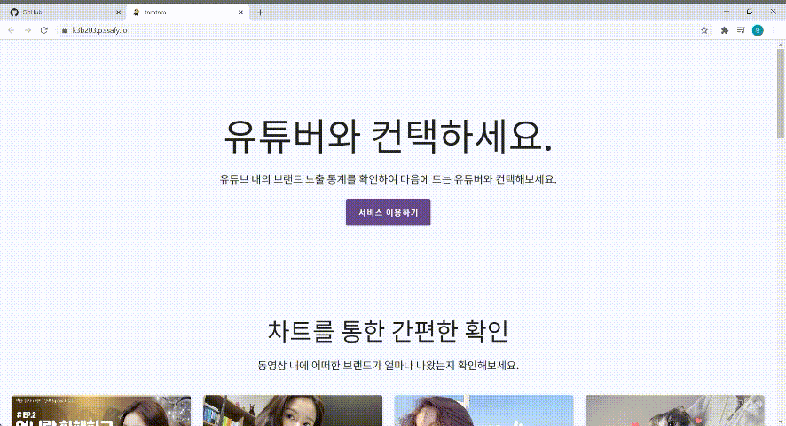
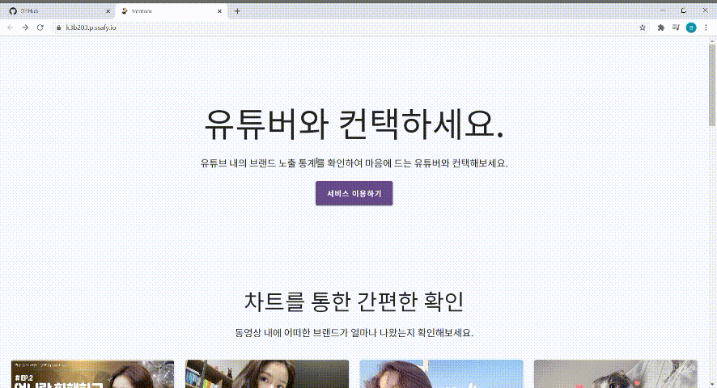

# TamTamLens

> 배포 주소: https://k3b203.p.ssafy.io/

 

 

 

Table of Contents
-----------------

[1. 역할 및 기술](#1-역할-및-기술)

[2. TamTamLens?](#2-TamTamLens)

​    [추진 배경](#추진 배경)

​    [TamTamLens 서비스 흐름도](#TamTamLens-서비스-흐름도)

[3. 주요기능]()

 

 

 

## 1. 역할 및 기술

 

### 주요 역할

Brand Detection Algorithm - 

Frontend - [메인 페이지](#), [비디오 페이지](#)

 

### 기술스택

- Frontend - Vue, SCSS
- Backend - express, mongoDB, mongoose
- Brand Detection Algorithm - python, Yolo3
- Server - AWS, NGINX

 

### 시스템 구조도

 

[:arrow_up:목차로](#Table-of-Contents)

 

 

 

## 2. TamTamLens?

- **비디오 스트리밍(유튜브)에 등장하는 브랜드 노출을 인식하여 기업에게 데이터를 제공해주는 B2B 서비스** 
- **각 유튜브 채널 및 동영상에 자사 브랜드가 얼마나 노출되었는지 확인 가능**

 

### 추진 배경

 

#### (1) 비디오 스트리밍 시대

> 유튜브 혹은 비디오 스트리밍 서비스를 이용하는 고객들이 많이 늘어나고 있습니다. 예전에는 20 ~ 30대의 젊은 사람들에게 국한되어 있는 서비스였다면 현재는 50대 이상이 가장 오래사용하는 앱에 유튜브가 선정될 정도로 남녀노소 유튜브를 사용하고 있습니다. 또한, 코로나 이슈로 인해 비디오 스트리밍 서비스를 이용하는 고객은 계속해서 증가하고 있는 추세입니다. 

 

#### (2) 비디오 스트리밍을 통한 광고 증가

> 비디오 스트리밍을 통한 광고 및 광고비용 역시 증가하고 있습니다. 일부 기업 내에서는 방송, 인쇄 등의 매체보다 디지털매체에서 소비하는 광고비가 증가하고 있는 추세입니다. 또한 연예인보다 유튜버의 정보 신뢰도가 높게 평가되고 있다는 흥미로운 설문조사 결과도 있는 만큼 유튜브 광고의 중요성이 더욱 커지고 있습니다. 때문에 기업들에게 어떤 유튜버가 우리 기업 물품을 자주 사용하는지에 대한 통계 데이터를 제공하여 보다 쉽게 광고의뢰를 할 수 있게 하는 B2B 서비스를 기획하였습니다.

 

 

 

### TamTamLens 서비스 흐름도

 

1. Youtube API, pytube3를 이용하여 영상의 정보 수집
   https://www.youtube.com/watch?v=tygr1fe3jWM

   
    

2. Yolo3로 유튜브 영상에서 브랜드 검출
   
    

3. 검출된 브랜드들의 등장 비율, 등장시간, 이동하기 기능 등 제공
   https://k3b203.p.ssafy.io/video/tygr1fe3jWM

   
    

 

[:arrow_up:목차로](#Table-of-Contents)

 

 

 

## 3. 주요기능

 

### 1) 서비스 소개 페이지

> 탐탐렌즈 서비스에서 어떤 정보를 얻을 수 있는지에 대해 간략내용을 제공합니다.

 

[:arrow_up:목차로](#Table-of-Contents)

 

 

### 2) 로그인

> B2B 서비스인 만큼, 회원가입 절차가 따로 없이 제공되는 아이디와 비밀번호로 로그인 한다는 가정 하에 진행하였습니다.
>
> 테스트 계정 아이디 및 비밀번호: samsung@test.com / ssafyb203

 

[:arrow_up:목차로](#Table-of-Contents)

 

 

### 3) 메인페이지

> 각종 기업의 분석정보를 보여주는 메인페이지입니다.
>
> - 영상에서 전체 브랜드 별 노출 순위
> - 업계별 브랜드 노출 순위
> - 내 기업 브랜드 노출 현황
> - 랜덤 유튜버 추천
> - 구독자 순 유튜버 TOP5
> - 구독자 수 대비 조회수 순 유튜버 TOP5
> - 업계 별 유튜버 추천
> - 업계 별 영상 추천
>
> 등 다양한 데이터를 제공합니다.

> 삼성에서 진행한 프로젝트이므로, 삼성으로 로그인 했을 때를 예시로 들자면
> 삼성은 IT/전자제품 업계로 분류하였으며, 같은 업계의 브랜드 lg, apple, sony 등의 기업 브랜드 노출 현황과 비교 할 수 있도록 하였습니다. 그리고 IT 카테고리를 가진 유튜버와 영상을 추천해주었습니다.

 

[:arrow_up:목차로](#Table-of-Contents)

 

 

### 4) 채널페이지

> 각 유튜버의 채널 정보를 볼 수 있는 페이지 입니다. 
>
> - 채널 스크랩
> - 광고 문의 => email.js 이용
> - 채널에 포함된 총 영상에서의 브랜드 노출 비율
> - 채널 구독자 수, 일일 조회수 한 달 변화량
> - 채널에 포함된 영상 목록 => 각 영상에서도 영상에 포함된 브랜드 비율 그래프 제공

 

[:arrow_up:목차로](#Table-of-Contents)

 

 

### 5) 동영상 재생 페이지

> 유튜브 동영상을 재생할 수 있는 페이지입니다. 
>
> - 동영상에 노출된 브랜드 비율 타임라인 => 타임라인을 클릭하면 브랜드가 인식된 시간으로 영상이 넘어가도록 설정
> - 동영상 스크랩
> - 동영상 정보가 잘못되었을 경우, 통계 제외 긴으
> - 오른쪽에는 나의 기업 브랜드가 제목이나 설명에 포함 된 영상 추천

 

[:arrow_up:목차로](#Table-of-Contents)

 

 

### 6) 나의 기업 페이지

> 내 기업의 분석 정보를 보여주는 페이지입니다.
>
> - 내 기업 관련 데이터 제공
>   - 전체 브랜드 중 노출 순위
>   - 내 기업 브랜드가 노출된 영상 개수
>   - 내 기업 브랜드가 노출된 총 시간
>   - 내가 스크랩한 채널 개수
> - 내가 스크랩 한 채널들의 현황 비교 그래프
>   - 구독자 수, 영상 수 비교 가능
> - 내가 보고싶은 기업들과 한 달간 브랜드 노출 비율 비교
> - 내 기업 브랜드가 많이 노출된 유튜버 추천
> - 내 기업 브랜드가 많이 노출된 영상 추천

 

[:arrow_up:목차로](#Table-of-Contents)

 

 

### 7) 마이페이지

> - 내가 컨택한 채널 목록
> - 내가 스크랩한 채널 목록
> - 내가 스크랩한 영상 목록

 

[:arrow_up:목차로](#Table-of-Contents)

 

 

### 8) 순위페이지

> - 구독자 순서 유튜버 목록
> - 구독자 수 대비 조회수 순서 유튜버 목록
> - 조회수 순서 영상 목록
> - 좋아요 순서 영상 목록

 

[:arrow_up:목차로](#Table-of-Contents)

 

 

