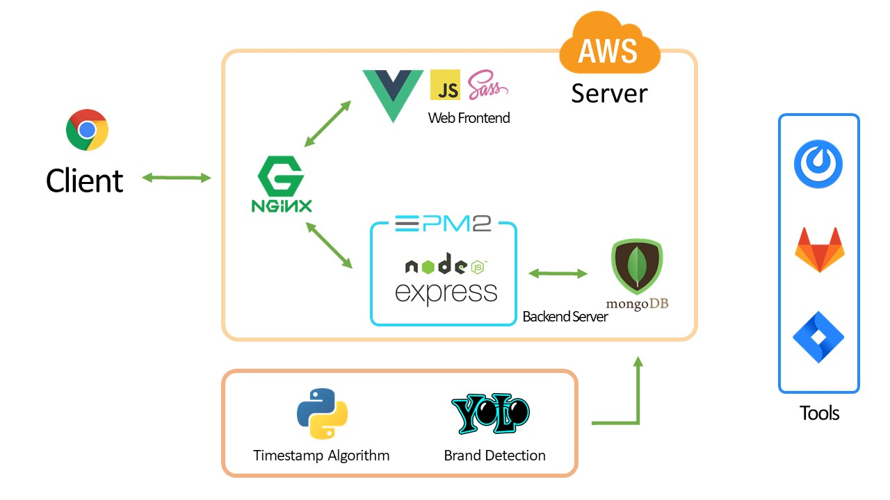
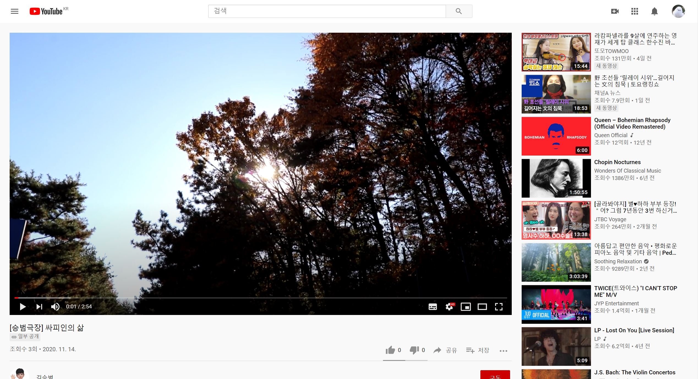
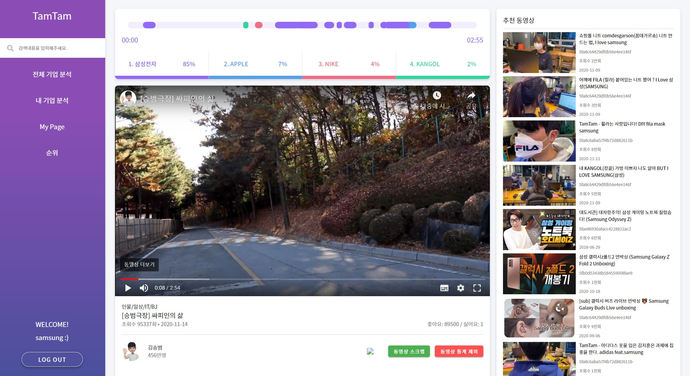

# TamTamLens

> 배포 주소: https://k3b203.p.ssafy.io/

 

 

 

Table of Contents
-----------------

[1. 역할 및 기술](#1-역할-및-기술)

[2. TamTamLens?](#2-TamTamLens)

​    [추진 배경](#추진 배경)

​    [TamTamLens 서비스 흐름도](#TamTamLens-서비스-흐름도)

[3. 주요기능]()

 

 

 

## 1. 역할 및 기술

 

### 주요 역할

Brand Detection Algorithm - 

Frontend - [메인 페이지](#), [비디오 페이지](#)

 

### 기술스택

- Frontend - Vue, SCSS
- Backend - express, mongoDB, mongoose
- Brand Detection Algorithm - python, Yolo3
- Server - AWS, NGINX

 

### 시스템 구조도

 

[:arrow_up:목차로](#Table-of-Contents)

 

 

 

## 2. TamTamLens?

- **비디오 스트리밍(유튜브)에 등장하는 브랜드 노출을 인식하여 기업에게 데이터를 제공해주는 B2B 서비스** 
- **각 유튜브 채널 및 동영상에 자사 브랜드가 얼마나 노출되었는지 확인 가능**

 

### 추진 배경

 

#### (1) 비디오 스트리밍 시대

> 유튜브 혹은 비디오 스트리밍 서비스를 이용하는 고객들이 많이 늘어나고 있습니다. 예전에는 20 ~ 30대의 젊은 사람들에게 국한되어 있는 서비스였다면 현재는 50대 이상이 가장 오래사용하는 앱에 유튜브가 선정될 정도로 남녀노소 유튜브를 사용하고 있습니다. 또한, 코로나 이슈로 인해 비디오 스트리밍 서비스를 이용하는 고객은 계속해서 증가하고 있는 추세입니다. 

 

#### (2) 비디오 스트리밍을 통한 광고 증가

> 비디오 스트리밍을 통한 광고 및 광고비용 역시 증가하고 있습니다. 일부 기업 내에서는 방송, 인쇄 등의 매체보다 디지털매체에서 소비하는 광고비가 증가하고 있는 추세입니다. 또한 연예인보다 유튜버의 정보 신뢰도가 높게 평가되고 있다는 흥미로운 설문조사 결과도 있는 만큼 유튜브 광고의 중요성이 더욱 커지고 있습니다. 때문에 기업들에게 어떤 유튜버가 우리 기업 물품을 자주 사용하는지에 대한 통계 데이터를 제공하여 보다 쉽게 광고의뢰를 할 수 있게 하는 B2B 서비스를 기획하였습니다.

 

 

 

### TamTamLens 서비스 흐름도

 

1. Youtube API, pytube3를 이용하여 영상의 정보 수집
   https://www.youtube.com/watch?v=tygr1fe3jWM

   
    

2. Yolo3로 유튜브 영상에서 브랜드 검출
   
    

3. 검출된 브랜드들의 등장 비율, 등장시간, 이동하기 기능 등 제공
   https://k3b203.p.ssafy.io/video/tygr1fe3jWM

   
    

 

[:arrow_up:목차로](#Table-of-Contents)

 

 

 

## 3. 주요기능

### 서비스 소개 페이지

### 메인페이지

### 내기업 분석 페이지

### 마이페이지

### 순위 페이지

### 체널 페이지

### 동영상 페이지

### 검색페이지

